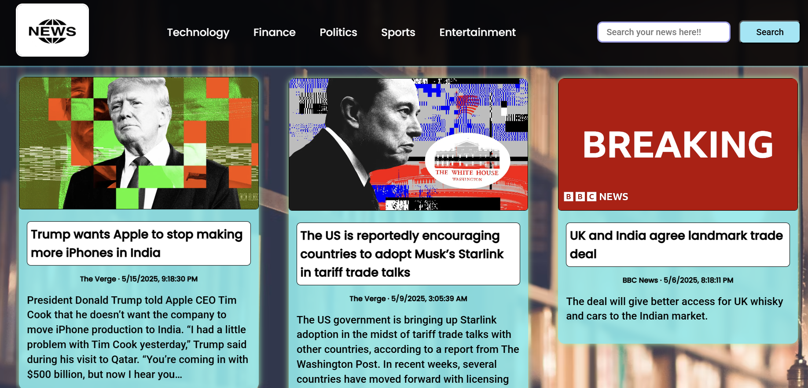
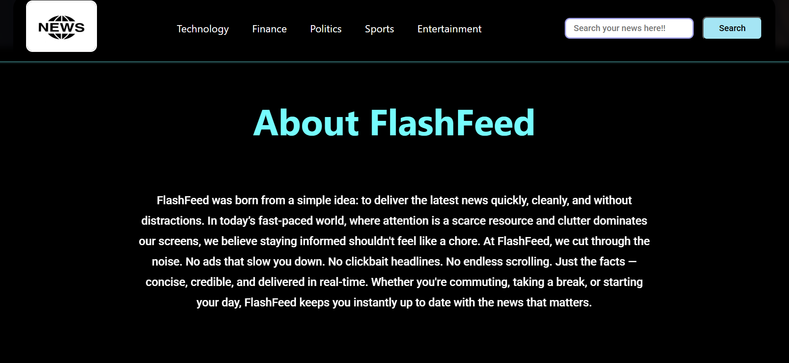
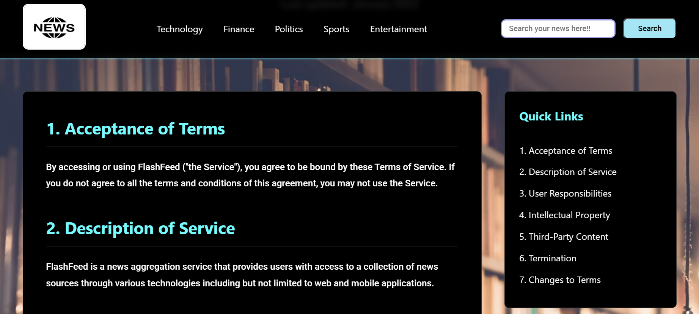

# ⚡ FlashFeed : Real-Time News Aggregator Web App

Welcome to **FlashFeed**, your one-stop portal for real-time, categorized news from trusted sources around the globe. Built using **HTML**, **CSS**, and **Vanilla JavaScript**, FlashFeed pulls the latest headlines using a **News API** and presents them in a fast, intuitive, and visually appealing interface.

<p align="center">
  
</p>

## 🌐 Live Demo

**[Click here to try FlashFeed](https://flash-feed-amber.vercel.app/)**


---

## 🚀 Features

- 🗞 **Live News Feed** – Get the latest news headlines from top media outlets.
- 🎯 **Category-Based Navigation** – Browse by Technology, Finance, Politics, Sports, or Entertainment.
- 🔍 **Search Bar** – Find news articles by keyword in seconds.
- 🟥 **Breaking News Section** – Highlighted alerts for urgent updates.
- 🌐 **Clickable Articles** – Jump to the full article on the original website.
- 🧭 **Responsive Design** – Works seamlessly across desktop and mobile devices.

---

## 🛠 Tech Stack

| Tech                 | Description                          |
| -------------------- | ------------------------------------ |
| **HTML5**            | Structure of the web application     |
| **CSS3**             | Custom styling and responsive layout |
| **JavaScript (ES6)** | API calls, DOM updates, routing      |
| **NewsAPI.org**      | Data source for real-time news       |

---

## 📸 images

### 📰 News Cards


### 🔍 Search Feature


### 🚨 About Us



### 🚨 Terms & Conditions



---

## 📦 How to Use

### 1️⃣ Prerequisites

- A modern web browser (Chrome, Firefox, Edge)
- [Node.js](https://nodejs.org/) and [Live Server](https://marketplace.visualstudio.com/items?itemName=ritwickdey.LiveServer) (optional but recommended for development)
- A free API key from [NewsAPI.org](https://newsapi.org/)

---

### 2️⃣ Clone the Repository

```bash
git clone https://github.com/yourusername/flashfeed.git
cd flashfeed
```

---

### 3️⃣ Add Your News API Key

1. Sign up at [https://newsapi.org](https://newsapi.org) and get your API key.
2. Inside the project directory, open the `js/NewsFeedWeb.js` file.
3. Replace the demo key with your key:

```javascript
const API_KEY = "YOUR_NEWS_API_KEY_HERE";
```

---

### 4️⃣ Run the App

#### Option 1: Open directly in a browser

- Open `html/NewsFeedWeb.html` in your browser.

#### Option 2: Use Live Server (recommended)

- Open the project folder in VS Code.
- Right-click on `html/NewsFeedWeb.html` → Click **"Open with Live Server"**.

---

###5️⃣ Deploy Your Own Instance

##Deploy to Vercel

Fork this repository to your GitHub account

Sign up for a free Vercel account

Click “New Project” and import your forked repository

Configure environment variables during setup or later in project settings:

Name: NEWS_API_KEY

Value: Your API key from NewsAPI.org

Click “Deploy”

---

## 🤝 Contributing

Pull requests are welcome! For major changes, please open an issue first to discuss what you would like to change.

```bash
# Fork the repo
# Create your feature branch
git checkout -b feature/YourFeature

# Commit your changes
git commit -m "Add: Your feature description"

# Push to the branch
git push origin feature/YourFeature

# Open a pull request
```

---

## 📄 License

This project is licensed under the **MIT License** – see the [LICENSE](./LICENSE) file for details.

---

## 🙌 Acknowledgements

- [NewsAPI.org](https://newsapi.org) for providing the free news data.
- Open source contributors and web dev community 💻🌍

---

**Stay informed, stay ahead – with FlashFeed ⚡**
